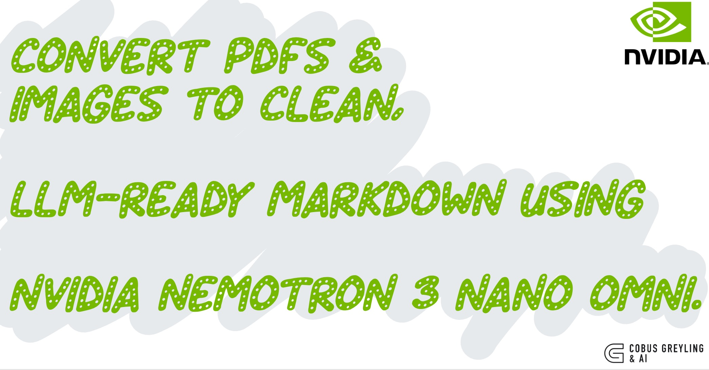

# doc2md



Convert PDFs, images, and Office documents (DOCX, PPTX) to clean, LLM-ready Markdown using NVIDIA Nemotron 3 Nano Omni.

```
  ┌──────────────────┐      ┌───────────────────────┐      ┌──────────────┐
  │  PDF / Image /   │ ───► │  Nemotron 3 Nano Omni │ ───► │  Markdown    │
  │  DOCX / PPTX     │      │  (Vision + Reasoning) │      │  (.md files) │
  └──────────────────┘      └───────────────────────┘      └──────────────┘
```

## Why

LLMs need clean text. PDFs and scanned documents are not clean text. This tool bridges the gap: it sends each page to Nemotron's vision model and gets back structured Markdown with proper headings, tables, lists, code blocks, and figure descriptions.

The output is designed to drop straight into RAG pipelines, LLM context windows, or knowledge bases.

## Requirements

- Python 3.10+
- For DOCX/PPTX support: [LibreOffice](https://www.libreoffice.org/) (used headless for conversion)

## Setup

```bash
pip install -r requirements.txt
```

Or install as a package (makes `doc2md` available as a CLI command):

```bash
pip install .
```

Set your NVIDIA API key:

```bash
export NVIDIA_API_KEY=nvapi-your-key-here
```

You can get an API key from the [NVIDIA API Catalog](https://build.nvidia.com/).

### LibreOffice (optional, for DOCX/PPTX)

```bash
# macOS
brew install --cask libreoffice

# Ubuntu / Debian
sudo apt install libreoffice-core

# Fedora
sudo dnf install libreoffice-core
```

## Usage

### Convert a PDF

```bash
python doc2md.py report.pdf
```

Each page becomes Markdown. Output goes to `output/report.md`.

### Convert images

```bash
python doc2md.py slide.png diagram.jpg whiteboard.jpeg
```

Each image becomes a separate `.md` file in `output/`.

### Convert Office documents

```bash
python doc2md.py presentation.pptx
python doc2md.py document.docx
```

DOCX and PPTX files are converted to PDF via LibreOffice headless, then processed through the same vision pipeline.

### Convert specific pages only

```bash
python doc2md.py report.pdf --pages 1-5
python doc2md.py report.pdf --pages 1,3,7-10
python doc2md.py report.pdf --pages -5        # first 5 pages
python doc2md.py report.pdf --pages 10-       # page 10 to end
```

### Convert a directory of documents

```bash
python doc2md.py ./documents/
```

Picks up all PDFs, images, and Office files in the directory.

### Combine everything into one file

```bash
python doc2md.py *.pdf --single-file --output knowledge_base.md
```

### Higher DPI for dense documents

```bash
python doc2md.py small-text.pdf --dpi 300
```

### Faster mode (skip reasoning)

```bash
python doc2md.py quick-scan.pdf --no-thinking
```

### Confidence scoring

Ask the model to rate its conversion confidence per page:

```bash
python doc2md.py report.pdf --confidence
```

Each page gets a score from 0.00 to 1.00 based on text legibility, layout complexity, and content clarity. Scores are shown in the summary and can help identify pages that need manual review.

### Validate output

Check generated Markdown for structural issues (unbalanced code fences, inconsistent tables, heading hierarchy breaks):

```bash
python doc2md.py report.pdf --validate
```

### Recursive directory scanning

```bash
python doc2md.py ./documents/ --recursive
```

### Skip already-converted files

```bash
python doc2md.py ./documents/ --skip-existing
```

### Parallel processing

```bash
python doc2md.py *.pdf --workers 4
```

### Verbose output

Show streaming model output instead of the progress bar:

```bash
python doc2md.py report.pdf --verbose
```

## Options

| Flag | Description |
|---|---|
| `--output-dir`, `-o` | Output directory (default: `output/`) |
| `--single-file`, `-s` | Combine all inputs into one Markdown file |
| `--output`, `-O` | Output file path (with `--single-file`) |
| `--dpi` | PDF rendering DPI (default: 200) |
| `--api-key` | NVIDIA API key (or use `NVIDIA_API_KEY` env var) |
| `--no-thinking` | Disable reasoning mode for faster conversion |
| `--pages`, `-p` | Page range to convert, e.g. `1-5`, `1,3,7-10` (PDFs/Office only) |
| `--confidence` | Score conversion confidence per page (0.00–1.00) |
| `--validate` | Check output Markdown for structural issues |
| `--verbose`, `-v` | Show streaming model output instead of progress bar |
| `--recursive`, `-r` | Scan directories recursively |
| `--skip-existing` | Skip files with existing `.md` output |
| `--workers`, `-w` | Number of files to process in parallel (default: 1) |
| `--version`, `-V` | Show version and exit |

## Supported Formats

**Documents:** PDF, DOCX, PPTX

**Images:** PNG, JPG/JPEG, TIFF/TIF, BMP, WebP

## How It Works

1. **Office files** (DOCX, PPTX) are first converted to PDF via LibreOffice headless
2. **PDFs** are rendered page-by-page into images using PyMuPDF
3. Each image is base64-encoded and sent to Nemotron 3 Nano Omni via the NVIDIA NIM API
4. The model extracts all visible content and converts it to structured Markdown
5. Output is assembled with page separators and written to disk

The model uses reasoning mode by default, which means it analyses document structure before producing output. This gives better results for complex layouts (multi-column, nested tables, mixed content). Use `--no-thinking` to skip reasoning for simple documents.

## What the Output Looks Like

The converter produces Markdown with:

- **Headings** preserved from the document hierarchy
- **Tables** as proper Markdown tables with alignment
- **Lists** (ordered and unordered) faithfully reproduced
- **Code blocks** wrapped in fenced blocks with language hints
- **Figures/charts** described in blockquotes: `> [Figure]: Description`
- **Math** in LaTeX notation: `$E = mc^2$`
- **Page breaks** as horizontal rules with page-number comments

## Model

This tool uses [NVIDIA Nemotron 3 Nano Omni](https://build.nvidia.com/) — a 30B-parameter mixture-of-experts model (3B active per inference) that natively processes text and images in a single forward pass. It leads on OCR benchmarks and produces structured output via an OpenAI-compatible API.

## License

MIT
